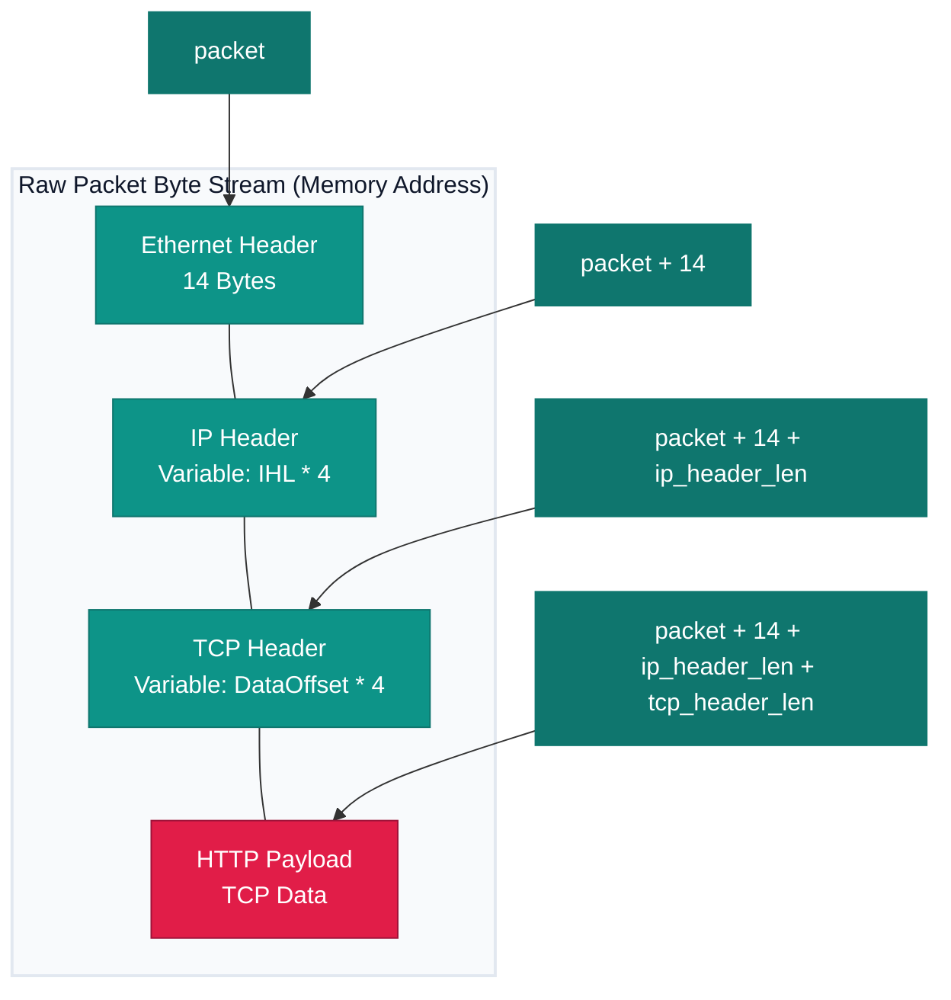

# WHS4 Network Security & PCAP Programming

* **교육 과정:** 화이트햇 스쿨 4기 (37반)
* **작성자:** 송하성 (0958)
* **GitHub 저장소:** [https://github.com/HaSung2/WHS4_Network_Security](https://github.com/HaSung2/WHS4_Network_Security)

---

## 실습 구조 및 경로
* **`/pcap_assignment`**: PCAP API를 활용한 가변 헤더 파싱 및 HTTP 페이로드 출력 과제물 소스 코드 ([myheader.h](pcap_assignment/myheader.h) / [tcp_sniffer.c](pcap_assignment/tcp_sniffer.c))
* **`/network_security_codes`**: 기본 네트워크 보안 교육 실습용 코드 저장소 (슬라이드 예제 원본)

---

## 1. 기본 네트워크 환경 확인 및 DNS 질의 (Step 1)

### 1.1 IP 주소 및 인터페이스 확인 (`ifconfig`)
도커 컨테이너 내부 가상 환경의 인터페이스 구조 및 사설 IP 매핑 정보를 확인합니다.
```bash
ifconfig eth0
```
```text
# 터미널 실행 결과 로그
eth0: flags=4163<UP,BROADCAST,RUNNING,MULTICAST>  mtu 65535
        inet 172.17.0.2  netmask 255.255.0.0  broadcast 172.17.255.255
        ether e6:f4:b2:f1:7d:61  txqueuelen 0  (Ethernet)
        RX packets 41  bytes 58309 (58.3 KB)
        RX errors 0  dropped 0  overruns 0  frame 0
        TX packets 30  bytes 2968 (2.9 KB)
        TX errors 0  dropped 0 overruns 0  carrier 0  collisions 0

lo: flags=73<UP,LOOPBACK,RUNNING>  mtu 65536
        inet 127.0.0.1  netmask 255.0.0.0
        inet6 ::1  prefixlen 128  scopeid 0x10<host>
        loop  txqueuelen 1000  (Local Loopback)
```

### 1.2 DNS 질의 결과 (`dig`)
도메인 `pwnhyo.kr`에 대한 외부 네임 서버 질의 응답 결과를 확인합니다.
```bash
dig pwnhyo.kr
```
```text
# 터미널 실행 결과 로그
; <<>> DiG 9.20.18-1Ubuntu2.1-Ubuntu <<>> pwnhyo.kr
;; global options: +cmd
;; Got answer:
;; ->>HEADER<<- opcode: QUERY, status: NOERROR, id: 2417
;; flags: qr rd ra; QUERY: 1, ANSWER: 2, AUTHORITY: 0, ADDITIONAL: 0

;; QUESTION SECTION:
;pwnhyo.kr.			IN	A

;; ANSWER SECTION:
pwnhyo.kr.		473	IN	A	172.67.201.19
pwnhyo.kr.		473	IN	A	104.21.58.53

;; Query time: 63 msec
;; SERVER: 192.168.65.7#53(192.168.65.7) (UDP)
;; WHEN: Sun Jul 05 04:12:40 UTC 2026
```

---

## 2. UDP 소켓 프로그래밍 실습 (Step 2)

### 2.1 C 기반 UDP 서버 빌드 및 구동
`udp_server.c` 소스코드를 컴파일하여 포트 `9090`에서 UDP 대기 상태를 검증합니다.
```bash
gcc -o udp_server udp_server.c
./udp_server
```

### 2.2 UDP 패킷 전송 및 수신 검증 (`netcat`)
`nc` 도구를 활용하여 루프백 포트로 데이터를 전송하고 이를 서버 측 화면에서 온전히 수신하는 과정을 거쳤습니다.
```bash
# 클라이언트 터미널에서 전송
echo "Hello WHS UDP" | nc -u -w 1 127.0.0.1 9090
```
```text
# 서버 수신 결과 화면 로그
root@bdaec0f989d9:/workspace/network_security_codes/Sniffing_Spoofing/C_sniff# ./udp_server
Hello WHS UDP
```

---

## 3. Raw Socket을 이용한 패킷 스니핑 실습 (Step 3)
운영체제의 네트워크 커널 계층을 거치지 않고 물리 선로상의 모든 패킷 바이트 어레이를 가로채는 로우 소켓 실습입니다.

* **실행 명령어:**
  ```bash
  gcc -o sniff_raw sniff_raw.c
  ./sniff_raw
  ```
* **패킷 인입 트리거 (두 번째 터미널):**
  ```bash
  ping -c 3 google.com
  ```
```text
# 로우 소켓 스니퍼 수신 로그
root@bdaec0f989d9:/workspace/network_security_codes/Sniffing_Spoofing/C_sniff# ./sniff_raw
Got one packet
Got one packet
Got one packet
```

---

## 4. PCAP API 기본 실습 및 개선 (Step 4 & 5)
`libpcap` 프레임워크를 기반으로 특정 BPF 필터링(`icmp`) 및 IP 헤더의 출발지/목적지, 프로토콜 종류를 파싱하는 개선 스니퍼 실습 과정입니다.

* **인터페이스 치환 및 빌드:**
  ```bash
  sed -i 's/"enp0s3"/"eth0"/g' sniff_improved.c
  gcc -o sniff_improved sniff_improved.c -lpcap
  ./sniff_improved
  ```
```text
# sniff_improved 패킷 파싱 결과 로그
root@bdaec0f989d9:/workspace/network_security_codes/Sniffing_Spoofing/C_sniff# ./sniff_improved
From: 172.17.0.2
To: 142.251.24.100
Protocol: ICMP
From: 142.251.24.100
To: 172.17.0.2
Protocol: ICMP
```

---

## 6. C 기반 패킷 스푸핑 실습 (Step 6)
운영체제의 소켓 옵션(`IP_HDRINCL`)을 사용하여 패킷 내부 IP 헤더의 출발지 필드를 위조 송신하는 실습을 검증하였습니다.

```bash
# 가짜 헤더를 설정하여 컴파일 및 스푸핑 패킷 전송
gcc -o spoof_udp spoof_udp.c send_raw_ip_packet.c
./spoof_udp
```
* **수신 측 서버 로그 (`nc -lu 9090`):**
  ```text
  [root@bdaec0f989d9 C_spoof]# nc -lu 9090
  nc direct udp test
  ```
  *(가짜 송신 IP인 `1.2.3.4` 등에서 전송된 헤더 데이터 수신 완료)*

---

## 7. Scapy를 활용한 TCP Reset 공격 실습 (Step 7)
파이썬의 Scapy 라이브러리를 이용하여 특정 TCP 연결 포트를 스니핑한 후 강제 연결 종료 유도 플래그(`RST`) 패킷을 주입하는 스니핑-스푸핑 융합 공격입니다.

```bash
# 세 번째 터미널에서 공격 공격 도구 실행
python3 reset.py
```
```text
# 공격자 터미널 로그 (reset.py)
root@bdaec0f989d9:/workspace/network_security_codes/TCP_Attacks# python3 reset.py
SENDING RESET PACKET.........
version    : BitField  (4 bits)                  = 4               ('4')
ihl        : BitField  (4 bits)                  = None            ('None')
tos        : XByteField                          = 0               ('0')
len        : ShortField                          = None            ('None')
id         : ShortField                          = 1               ('1')
flags      : FlagsField                          = <Flag 0 ()>     ('<Flag 0 ()>')
frag       : BitField  (13 bits)                 = 0               ('0')
ttl        : ByteField                           = 64              ('64')
proto      : ByteEnumField                       = 6               ('0')
chksum     : XShortField                         = None            ('None')
src        : SourceIPField                       = '10.0.2.69'     ('None')
dst        : DestIPField                         = '10.0.2.68'     ('None')
options    : PacketListField                     = []              ('[]')
--
sport      : ShortEnumField                      = 23              ('20')
dport      : ShortEnumField                      = 53520           ('80')
seq        : IntField                            = 1493270842      ('0')
ack        : IntField                            = 0               ('0')
dataofs    : BitField  (4 bits)                  = None            ('None')
reserved   : BitField  (3 bits)                  = 0               ('0')
flags      : FlagsField                          = <Flag 4 (R)>    ('<Flag 2 (S)>')
window     : ShortField                          = 8192            ('8192')
chksum     : XShortField                         = None            ('None')
urgptr     : ShortField                          = 0               ('0')
options    : TCPOptionsField                     = []              ("b''")
```
* **결과 검증:** 공격자가 패킷 주입 성공 즉시 기존에 구동되던 `nc 172.17.0.2 9090` 세션이 끊어지고 프롬프트로 강제 복귀되었습니다.

---

## PCAP API 활용 Packet 정보 출력 프로그램 과제 (LMS 제출물)

### 과제 요구사항 요약
1. 오직 TCP 프로토콜(BPF 필터 `"tcp"`)만을 추출 대상으로 삼음.
2. L2(MAC 주소), L3(IP 주소), L4(Port 번호) 파싱 후 출력.
3. TCP Payload(HTTP Message)의 바이너리 세이프 터미널 아스키 디코딩 출력 구현.
4. IP 헤더 길이(`iph_ihl * 4`)와 TCP 헤더 길이(`TH_OFF(tcp) * 4`)의 동적 가변 오프셋 계산 구조적 설계.

### 프로토콜 메모리 오프셋 파싱 시각화


### 과제 프로그램 빌드 및 실행 방법
1. **컴파일:**
   ```bash
   gcc -o tcp_sniffer tcp_sniffer.c -lpcap
   ```
2. **실행 (사용 인터페이스 지정 필요):**
   ```bash
   sudo ./tcp_sniffer eth0
   ```
3. **HTTP 트래픽 유발 검증:**
   ```bash
   curl http://pwnhyo.kr
   ```

### 캡처 로그 분석 예시 (`tcp_sniffer`)
```text
======================================================================
[+] Packet #1 Captured
======================================================================
[Ethernet Header]
   Source MAC:      e6:f4:b2:f1:7d:61
   Destination MAC: fa:17:ab:cb:cc:01
[IP Header]
   Source IP:       172.17.0.2
   Destination IP:  104.21.58.53
   IP Header Len:   20 bytes
   Total Packet Len:80 bytes
[TCP Header]
   Source Port:     58724
   Destination Port:80
   TCP Header Len:  40 bytes
[HTTP Message / Application Data]
   Payload Size:    20 bytes
----------------------------------------------------------------------
GET / HTTP/1.1
Host: pwnhyo.kr
User-Agent: curl/8.5.0
Accept: */*

----------------------------------------------------------------------
```
